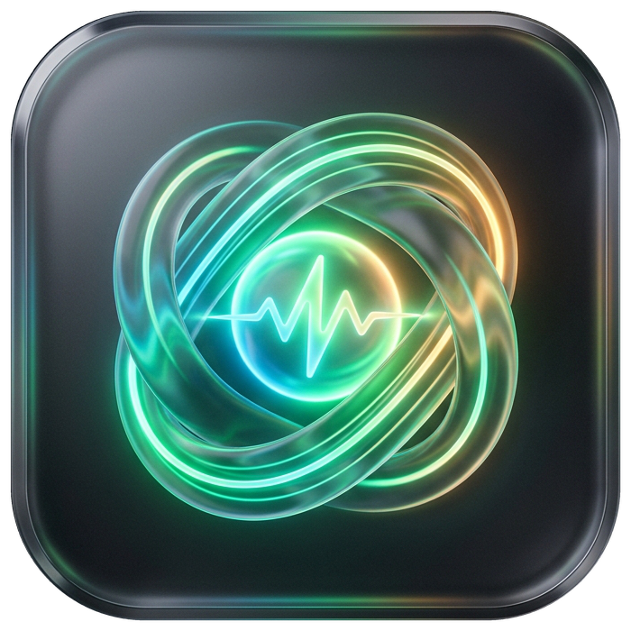

# ⚡ FerrisPulse · 灵脉 (多品牌外设电量管家与独占感知引擎) v3.2.1

<p align="center">
  
</p>

<p align="center">
  <b>专为雷蛇、罗技、雷柏、NuPhy 及国产电竞外设打造的高颜值、极轻量 Windows 任务栏电量与硬件管理引擎</b>
</p>

<p align="center">
  
  
  
  
</p>

---

## 💡 为什么需要它？

官方驱动全家桶（如 **Razer Synapse 雷云**、**Logitech G HUB** 等）常驻 8~10 个后台进程，长期吞噬 **500MB~1GB** 物理内存与 CPU 资源，开机变慢，且设备静置休眠后经常误报 0% 电量。

**FerrisPulse · 灵脉** 彻底颠覆这一切：
* ⚡ **极速轻量**：仅约 **15MB** 常驻内存，0.1秒秒速冷启，单文件绿色免安装，CPU 占用长期 **0.00%**。
* 🎮 **全屏电竞游戏智能感知与回报率自动切换**：
  - 独创进程级前台焦点精准感知与专属游戏管理窗口，一键捕获当前运行游戏或添加本地 `.exe`，100% 反作弊安全；
  - 进入游戏无感自动切入高回报率（如 4000Hz / 8000Hz），退出游戏智能平滑回退常规桌面回报率（如 1000Hz），最大化降低无线耗电；
  - 具备 60FPS 平滑缓动风琴动画、实时硬件生效指示徽章、浏览器/播放器防误触白名单与 1200ms 防抖仲裁，搭配无感游戏 OSD 与非阻塞全屏双频电子提示音盲操确认。
* 🌐 **多品牌全生态原生直连**：
  - **雷蛇 (Razer)**：专有 90 字节 Report 协议，全系无线鼠标电量直接读取与回报率设置；
  - **罗技 (Logitech)**：自研 HID++ 1.0/2.0+ 驱动引擎，原生握手 Lightspeed 接收器、优联与有线通道，免驱动获取固件全称与精准电量；
  - **雷柏 (Rapoo)**：专有 64 字节 Feature Report 协议直连；
  - **NuPhy (努斐)**：全系机械键盘休眠超时调节、WinLock 开关、背光开关与无级亮度调节；
  - **国产电竞矩阵 (CompX 方案)**：ATK、VGN、VXE、迈从 (MCHOSE)、狼蛛 (AULA) 等多通道设备识别与切换。
* 🛡️ **五重独占键盘测速仪 (Exclusive Keyboard Grab)**：
  - 全键并发无冲 (NKRO) 与击键毫秒延迟实时测速；
  - 采用 **RawInput 硬件独占锁 + 低级钩子 + 输入法全脱钩 + 菜单抑制**，测试期间彻底阻断系统快捷键与微信、QQ、截图软件等一切第三方热键，支持按 ESC 一键安全退出。
* 🎨 **Windows 11 原生美学**：深度契合 Win11 暗黑圆角、Mica 拟态半透明质感，三大原生托盘风格自由切换。
* 🔋 **独家智能休眠待机算法**：区分「物理拔出断联」与「静置休眠待机」，休眠时显示高雅琥珀金待机状态并记忆电量，拿起鼠标瞬间毫秒级刷新。
* 🎯 **全屏游戏无感 OSD**：Win32 底层零焦点悬浮 (`SWP_NOACTIVATE`) 与鼠标 100% 物理穿透 (`WS_EX_TRANSPARENT`)，调节 DPI 与回报率顺滑浮现，无边框全屏游戏绝不切回桌面、绝不吞枪！

---

## 🛠️ 本地编译构建

本项目采用纯 C# 单文件编写，使用 Windows 系统自带的 .NET Framework 编译器，**无需安装 Visual Studio 等庞大 IDE** 即可秒级编译：

```cmd
# 克隆仓库
git clone https://github.com/Ferris-echo/RazerBatteryTray.git
cd RazerBatteryTray

# 运行一键构建脚本 (自动嵌入高清 app.ico 图标)
build.bat
```

构建完成后将在当前目录生成独立的单文件 `FerrisPulse.exe`。

---

## 📦 下载与运行

* **便携版下载**：访问 [Releases 页面](../../releases) 下载最新版的 `FerrisPulse_v3.0_Portable.zip`。
* **运行方式**：解压后双击 `FerrisPulse.exe` 即可运行。
* **初次运行提示**：因个人开源作品未购买商业数字证书，若弹出 Windows SmartScreen 提示，点击 **「更多信息」 -> 「仍要运行」** 即可。

---

## 📄 开源许可证

本项目基于 [MIT License](LICENSE) 协议开源。
